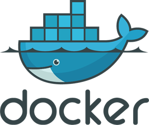

# Jellyfin suite for cloudron
## Introduction
As cloudron team has not the right to plublish piracy related applications I decided to create myself custom apps.

**This repository includes:**
- [Jellyseerr](https://github.com/Fallenbagel/jellyseerr) cloudron app
- [Prowlarr](https://github.com/Prowlarr/Prowlarr) cloudron app
- [Radarr](https://github.com/Radarr/Radarr) cloudron app
- [Nzbget](https://github.com/nzbgetcom/nzbget) cloudron app
- [Sonarr](https://github.com/Sonarr/Sonarr) cloudron app

All docker image are available on docker hub: [Docker Hub](https://hub.docker.com/u/jbrichez)

### ⚠️ Warning
Those apps are custom so unfortunately automatic updates are not possible. Thus, I will need to update manually docker's images on every update.
I will try my best but you can still make a PR with updates.

## prerequisites
You need to install Cloudron CLI: [here](https://docs.cloudron.io/packaging/cli/).
After you need to connect the CLI to your cloudron instance.

### Install app
To install any custom app below, you need to move to app's folder then:
```
cloudron install --image [DOCKER IMAGE NAME]
```
as said [here](https://docs.cloudron.io/packaging/tutorial/#install) in the doc.

You need to be in the folder of the app you want to install before running the command. Because cloudron CLI needs to read `CloudronManifest.json` file.

### Cloudron volumes
You will need to create 2 volumes:
- (1) volume as **nzbget download folder**
- (2) volume as **your movies library** for jellybin

Here is the guide to create cloudron volume: [guide](https://docs.cloudron.io/volumes/#add). </br>

**I recommand to choose "Filesystem" mount type when you create the volumes.** </br>
**⚠️ You need to physicaly create the folder on host before, cloudron can't create one for you.**

You will need to mount (1) and (2) to Radarr's App. </br>
Connect (1) to nzbget app. </br>
Connect (2) to jellybin app.

You can mount volumes to app in the app's settings and "storage" tab.

### Docker network
You will need to have the internal IP of your container when you will connect services together.
To get private IP you need to connect to you VPS.

Get your container's name:
````
docker ps - a
````

Find the cloudron network's name (some of time: cloudron):
````
docker network ls
````
List ip of all containers connected to network:
````
docker network inspect cloudron
````

## Applications

### Jellyserr
<a href="https://hub.docker.com/repository/docker/jbrichez/cloudron-jellyseerr/general">
 Docker image
</a>

Jellyseerr is a free and open source software application for managing requests for your media library.

### Prowlarr
<a href="https://hub.docker.com/repository/docker/jbrichez/cloudron-prowlarr/general">
 Docker image
</a>

Prowlarr is an indexer manager/proxy built on the popular *arr .net

### Radarr
<a href="https://hub.docker.com/repository/docker/jbrichez/cloudron-radarr/general">
 Docker image
</a>

Radarr is a movie collection manager for Usenet and BitTorrent users.

### Sonarr
<a href="https://hub.docker.com/repository/docker/jbrichez/cloudron-sonarr/general">
 Docker image
</a>

Sonarr is a PVR for Usenet and BitTorrent users.

### Nzbget
<a href="https://hub.docker.com/repository/docker/jbrichez/cloudron-nzbget/general">
 Docker image
</a>

NZBGet is a binary downloader, which downloads files from Usenet based on information given in nzb-files.

#### Instructions
Go to the app's file manager (available in app's settings).
Create a `config` folder then create a `nzbget.conf` file and copy/past the content of [`nzbget.conf`](./nzbget/nzbget.conf) inside.

Modify inside the file, set:
- `MainDir` to `path of your mounted volume`
- `webDir` to `/app/code/nzbget/webui/`
- `ConfigTemplate` to `/app/code/nzbget/webui/nzbget.conf`

If you have an error in the logs telling that the app didn't have access to app data, try running on your host: </br>
`chown -R cloudron config` on `/app/data` folder.

